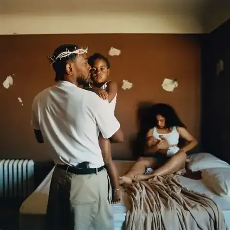

Look, every generation has their cringe phase. Ours is just speedrunning emotional bankruptcy on TikTok.

## The Nonchalant Epidemic

You see teenagers on TikTok today looking all nonchalant, unemotional or robotic as hell. They look like they do not give one fuck. It’s so fucking cringe. It’s like an emo phase that millennials (remember the generation before us?) had went through and held a label on them. Some would say “It’s just a phase”. You know what I say to that? Fuck Yeah! Not one all-black, chained hanging, make-up wearing piece of shit walking around the streets no more. Except the Goth baddies, they can stay (rawr).

But the differences tho: emo kids were at least **feeling** something. They were *sad*, angry, misunderstood or whatever. They had emotions and weren’t afraid to show it, even if it looked kinda stupid. Nowadays? It’s all just “ion giv a fuk lmao” attitude that pisses me off so fucking much. Because personally, I, too, *dun giv a fuk lmao* yet I appear significantly more vibrant as a person than these nonchalant fucking dreadheads scrolling through their FYP with the same pan expression they use for LITERALLY everthing else.

And the worse part is, this isn’t just about impressing the baddies and huzz. This is about an entire generation performing emotional death because the “algorithm” told them that it looks cool. 

## Kung Fu Kenny

In 2022, Kendrick Lamar released what I consider to be his best project, Mr. Morale and the Big Steppers. The album is a therapy session spread across 18 tracks, but it's the second track—N95—that cuts straight to the throat of what I'm talking about. A literal fucking dissection of this dichotomy. 

Let’s start with the title itself, N95. It’s a face mask we all wore during COVID-19. At least the most of us did. But Kendrick Lamar isn’t directly intricate about the mask we physically wear. he’s talking about the mask we emotionally wear, ourselves. The metaphor works on multiple levels, we wear a mask to protect others from ourselves, we wear a mask to protect ourselves from others. From being hurt, from being *seen*. 

The opening lines hit like a fucking truck on ice.

> Take off the foo-foo;
Take off the clout chase;
Take off the Wi-Fi;
Take off the money phone;
Take off the car loan;
Take off the flex and the white lies;
> 

Kendrick Lamar is calling out the façade of status, the performance of success, the fake bravado people tend to entail to cover up their insecurities and real emotions that hide within. 

But here’s where it gets real interesting for our nonchalant generation: Kendrick Lamar isn’t just talking about the material wealth flexing. He’s explicitly talking about emotional flexing too. The whole song is about stripping away or *taking off* every layer of bullshit until you are left the raw, unfiltered version of ourselves, and how terrifying that is for most people. 

There’s a line in the song where Kendrick Lamar talks about the performance of it all, like how everyone is trying to be someone they’re not. And that is **exactly** what nonchalance is in 2025. It’s not genuine indifference but rather a performance. It’s them flexing emotional unavailability like it’s designer clothing or on-brand watches. You’re wearing your lack of passion like it’s a status or a crown, something to be proud of.

The music video along with this track makes it far more clear. Kendrick literally strips away from different personas, different masks, different ideas of himself. And by the end, you’re not even sure who the *real* Kendrick Lamar really is, which is the whole point. We have all worn so many masks for so long that we have forgotten what our actual faces look like. 

Hiding from our true selves for so long, we hate the way we actually look. 

> you ugly as fuck
> 

It’s saying we’re disgusted by ourselves for putting on layers of a fake persona, or that we have conformed to our fake selves that we hate the way we actually look.

## MF DOOM (I’ll keep it short, I promise)

MF DOOM wears a mask. He built he whole career around it. The metal mask was his brand, his identity, it was MF DOOM.

But there’s a major difference between DOOM and what Kendrick is talking about. DOOM’s intentions lies in art, and disassociation from Daniel Dumile. It was commentary on his identity, on superhero culture, on the music industry, on him as a writer. When he wears the mask, he wasn’t hiding himself, he was transitioning. The mask isn’t about emotional unavailability, it was about creatng space for creative freedom. He had many personas, Viktor Vaughn, King Geedorah, Metal Fingers DOOM. Each a different aspect of his creativity. 

DOOM’s mask were additive to his creative ideas. They added a deep complexity, depth, layers of meaning. Your nonchalant mask is subtractive. It removes personality, passion, authenticity. DOOM used his mask to say more. Yours is used to say less. MF GLOOM type shit.

DOOM’s actual emotions bled through his music constantly. You can easily hear what DOOM is thinking about right there in between the words. He writes about his brother’s death, about being broke and disheveled, about struggling in the music industry, about love and loss and pain. The mask didn’t hide his humanity, it amplified it by creating contrast. You could hear the real person underneath the villainous persona. 

Your nonchalant mask isn't creating art. It's creating a void of what used to be your personality. It’s distancing you from real emotions.

When DOOM rapped, “All caps when you spell the man name,” he was demanding regard, recognition, respect. The polar opposites of nonchalance. He had deep concerns about his craft, his legacy as the underground rapper, his impact in the wider world. The mask was a channel between you and his thoughts. Your mask keeps you camouflage like a prey in a hostile environment. 

The question Kendrick Lamar poses in his song, “What are you willing to take off?”, hits different when you realize some of us have been wearing one for so long we’re forgotten it’s there. DOOM could take his mask off and remain as Dumile. Will you be you if you removed yours?

## But Isaiah, What If You’re Wrong?

Probably. Maybe being nonchalance isn’t just some teenage stupidity, and there’s an actual rational response to the world we’re currently living in right now.

We are quite literally the first generation to grow up with every little embarrassing moment potentially going viral, losing our jobs, ruining our lives. Every passionate interests, every emotional reaction, every vulnerable moment can be screenshot, screen-recorded, and shared with thousands if not millions of people who will mock you for engagement. We are living in an age of constant surveillance where your digital footprint follows you everywhere, forever. That TikTok you posted at 14? Still out there. That Twitter thread where you got too excited about something? Archived. That time you cried on your Instagram story? Remembered.

The internet is forever, and this entity is nothing short of cruel.

So maybe, being nonchalant is actually a response, a defensive strategy we took on to survive. If you never cared about anything publicly, you never give people ammunition to hold it against you. If you never show passion, you never give them something to mock. If you never reveal your true self, you never get hurt when people reject it. It’s emotional armour in an age where knives drags everywhere around us. 

I kinda get it tho. When I show constantly lean interests in cybersecurity, about using VPNs when on school WiFI, or about threat models and data collection, about decentralizing your accounts to quit on digital footprint, to hide from other digital attacks, everyone looks at me like I’m fucking psychotic and paranoid or autistic. But I’m *not* paranoid, I’m just aware of my surroundings. I happen to have the ability to process information far quicker, thus I learn more things quickly. I know that everything I do online is being tracked, logged, analyzed, fed to me through adverts. Every search query, every click, every ChatGPT prompt, every moment of engagement is data that feeds the machine. So I love to take heavy precautions.

And I guess nonchalance is as similar. Maybe you’re taking emotional precautions. Maybe you have noticed that authenticity is a liability in the attention economy, and you’ve decided to opt out. You’ve gone grey. You’ve become emotionally untraceable. 

And I can’t blame you. The world is hostile to vulnerability. The algorithm punishes authenticity sometimes. People get bullied for caring too much. 

But here’s where I’m gonna go against it like David and Goliath. You’re not protecting yourself. You’re just slowly killing the parts of yourself that define you and make life worth living for. It isn’t like a VPN that masks your IP, it masks you. 

Wear a mask long enough, it stops protecting you, it becomes a feature, a cage. You think you’re protecting yourself, but you really are just preventing yourself from feeling anything. The mask becomes the face, the performance becomes the personality.

And yeah, maybe you avoid *some* embarrassment, dodge some mockery. But you’re giving up genuine connection, real friendship and the ability to get excited over things without self-consciousness. The capacity to be moved by art, music, beauty, life. 

You traded your humanity for safety and a bunch of social credits. The fucked up part? You’re not even getting real safety. Or real social credit. You’re still just as anxious, depressed and lonely. You just look cool on camera maybe. 

So I guess I agree that being nonchalant is a survival mechanic, but so is not leaving your fucking house. So is not making friends. So is not trying new things. Just because somethings helps you survive, doesn’t mean it helps you live.

## The Tyler Durden Delusion

Quite the sigma male mindset. Stop the Mads Mikkelsen, Andrew Tate, Brad Pitt persona. Pretending to not care, especially when you and I both know you do.

Let me be clear about who I'm talking about here, because there's layers to this nonchalant bullshit.

There's the "5 AM morning routine" guys. You know the ones. They film themselves waking up in the dark (always the dark, because apparently sunlight is for betas). Cut to them chugging a raw egg like it's a shot of vodka. Cut to them staring dead-eyed into the camera while Hans Zimmer's "Time" from Interstellar plays at max volume. Text on screen: "While you were sleeping, I was getting better." Brother, you drank an egg. You didn't cure cancer.

These videos always have the same aesthetic: grainy film filter to look "authentic," minimal cuts to show they're "not trying hard," and that fucking thousand-yard stare like they've seen some shit. What shit have you seen, Kyle? You're 17 and your biggest struggle is whether to take your dad's Civic or walk to school.

Then there's the gym content. Not normal gym content where people are actually excited about hitting a PR or learning a new technique. No, this is the shit where they're doing bicep curls with the same energy as filling out a tax form. Dead eyes. No expression. Just reps. The caption? "Silence is strength 💀" or some variation of that. Comments are always the same too:

"Real recognize real"
"This is the way"
"💀💀💀"
"Bro understood the assignment"

Understood what assignment? To be as boring as possible? To look like an NPC? Congratulations, you're speedrunning having no personality.

Every single photo is color-graded to look like it was taken in 2004. Everything is desaturated. Everything is moody. Everything is trying SO HARD to look like they're not trying. 

The best part? These accounts get thousands of comments like:
"You different fr"
"Main character energy"
"Why you lowkey mysterious tho 👀"

Different how? You look like every other person doing this exact same shit. There are literally MILLIONS of these accounts. You're not mysterious, you're just boring with good lighting.

But oh it gets worse. The comment section culture. Someone will post their art, their music, something they genuinely made and are proud of. And the top comment with 500 likes is always:

"that's crazy 🔥"

That's it. That's the whole comment. No elaboration. No actual engagement. Just "that's crazy" like they're a bot programmed to generate the minimum viable response. Or even worse:

"you cooking fr fr"
"this lowkey fire"
"ion even know what to say 💀"

Then SAY NOTHING. If you "don't even know what to say," why are you commenting? Why are you taking up space in the comments with your performative non-reaction? I see this shit constantly. Someone will post a cover of a song they learned, something that took hours of practice, genuine effort and vulnerability to share. It low-key pisses me off.

That's not support. That's not community. That's you performing the bare minimum of acknowledgment so you can feel like you engaged without actually engaging. It's interaction without connection. It's the social media equivalent of the "k" text response.

And here's the thing that fucking kills me: I see people doing this to their actual friends. Not strangers. FRIENDS. Your boy posts something he's proud of and you can't even muster up a real comment? You can't say "yo this is actually sick, the part at 1:23 was my favorite"? You can't give him ANYTHING real?

No, because real enthusiasm is cringe. Real support is try-hard. Real emotions are for people who haven't discovered stoicism (a philosophy you learned from a 60-second TikTok and immediately misunderstood).

The algorithm rewards this shit too. The "that's crazy 🔥" comment gets pushed to the top because it got early engagement. The person who wrote three paragraphs about why they loved it? Buried at the bottom. Nobody sees it. So people learn: minimal effort gets maximum visibility. Authentic engagement gets ignored.

So everyone adapts. Everyone starts commenting the same shit. Everyone performs the same nonchalance. And the whole internet becomes a wasteland of people pretending not to care about anything while desperately hoping someone will notice them not caring.

It's fucking exhausting.

## Big Brain Not So Big

Let’s discuss something that’s happening right now. Your big bwain. 

Your brain, my brain, us brain, is fundamentally lopsided. At least for us teenagers. The emotional center, the amygdala, developed way earlier than the reasoning center, the prefrontal cortex. The amygdala handles emotions, rewards, impulses. The prefrontal cortex handles logic, planning, impulse **control**. Guess which one is fully operational right now and which is still developing within us until we turn 25?

Ok, how about this. Imagine you’re driving a car (assuming you’re old enough) where the gas pedal is extremely sensitive, like a wire line. While the brakes barely work, they do, but it’s REALLY hard, like Formula 1 brakes. Every emotion hits HARD. Every social reward feels INTENSE. Every embarrassment cuts DEEP. But your ability to regulate those feelings, to put them into perspective, to calm yourself down, is still under construction. 

This is why making a joke with your friends that lands feel FAR better than snorting methylenedioxymethamphetamine. This is why getting left on read feels like cutting your skin with. This is why one negative comment can ruin our whole day. Our emotional accelerator is maxmaxxing while our emotional brakes are eepy nappy time. 

Thus the solution; A nonchalant mask. If your brain is going to make you feel everything intensely, the solution seems quite simple, just stop feeling. Or at least stop showing that you *can* feel. Put on the dead-eyed expression, adopt the monotone voice, and train yourself to react to everything with the same mild disinterest; a shrug and go “shii ion no”.

It’s like you’re trying to debug your own brain by shutting down the fucking emotion.exe program entirely. 

Guess what, bitch? Suppressing your emotions don’t make em go away. It just makes it swirl around our heads unprocessed. My own research even backs this up heavily, the studies on emotional suppression show it doesn’t actually reduce emotional experience; it just reduces emotional expression. Basically, you’re not less fucked up, you just better at hiding it. 

Imagine like being drunk but pretending you’re sober. 

And the cortisol, the stress hormones, the adrenaline, are still flooding your system. Your body is still reacting even if your fave isn’t. You’re just creating a disconnect between internal experience and external presentation. That disconnect is called dissociation, and it is NOT healthy, nor cool, nor sustainable. 

Your brain is literally marinating is stress juices that makes you wanna crawl out of your skin so you put on a deadpan face as a way of coping. Stress doesn’t go away, it just ferments inside. 

## I’m Horny, Therefore I Perform

I’m not gonna fuck around here. A lot of this nonchalant performance is about impressing people you wanna fuck. I ain’t gon lie, me too.

Puberty is flooding our system with testosterone, estrogen, and progesterone, turning us into a hormonal slot machine where we never know what emotion is finna hit next. One minute you’re fine, the next you’re angry for no fucking reason, then you’re horny and wanna fuck that bad bitch you say walking past you, then you’re all of em at once. It’s a huge fucking mess.

And testosterone especially, low-key my favourite chaos hormone, doesn’t just make you horny, it makes it hella aggressive, impulsive, risk-taking. It makes you want compete, to dominate, to prove to yourself. For us guys, there’s this constant undercurrent of “Am I sigma alpha skibidi enough, gang?” (Kinda cringe but you know it’s true)

So here’s the thing. If I appear unbothered, unaffected, emotionally unavailable, maybe that reads as confidence. Maybe that says that I am indulged in strength. Maybe it shows “high value” or whatever the fuck the manosphere is calling it last week.

The logic is: people who care are desperate, and people who don’t care are desirable. Indifference is attractive. Enthusiasm is needy. Tell me I’m wrong.

And I get the appeal. I understand wanting to bag a cutie patootie, I certainly want to. I understand the instinct to perform whatever version of yourself seems most likely to get attention from the people you’re attracted to. 

But **reality check**: most people our age aren’t actually attracted to nonchalance. They love confidence, yeah. But confidence and emotional flatness aren’t the same thing. Real confidence is being passionate about your interests and not giving a fuck about labels being put on you. Fake confidence is pretending not to have interests in the first place. 

That shortie you tryna fuck with? She can tell the sad difference. The gut you’re trying to impress? It can tell the difference. Everyone can tell the difference between someone who actually, truly cares and someone who’s performing the false act of security. 

Even if the performance works, even if you successfully trick someone into thinking you're this cool unbothered person, what happens when they actually get to know you? The mask slips, and they realize you actually do care about things, you’re just too much of a bitch and don’t have the courage to show it. 

You have built a relationship on one big lie. You have attracted someone who likes the fake you, not the real you. Congrats, you played the bitch, you played yourself, gang.

## What’s Wrong with my FYP?

I mean For You Page, not Final Year Project.

I mean like TikTok, Instagram, YouTube, Twitter (Not X, fuck you), and every other social media platform. It is actively incentivizing you to be nonchalant.

The *algorithm* doesn’t care about your emotional wellbeing, it feeds on the lack thereof. The algorithm cares about the engagement. You know what drives engagement? Controversy, correct. One cookie for you. It’s conflict. Strong reactions. But here’s the twist; le algorithm ALSO rewards consistency and volume.

Quick reaction videos where you watch something and respond with minimal effort has consistent and high-volume. The nonchalant reaction video, where you watch some wild shit and go “damn, that’s crazy” with a deadpan expression, is algorithmically perfect. It’s very easy to make, it’s parasocial enough to have little connection but not deep enough to mog over, and it doesn’t require you to have an opinion that might alienate part of your audience.

Being nonchalant is the path of the least resistance in the content economy.

Think about how TikTok works; you have seconds to grab attention, you’re scrolling through thousands of videos a day. The human brain is not able to process that much emotional stimulus, so it starts to flatten it all. Like those machine press videos that crushes Skittles and shit. Tragedy, comedy, cringe, corny, commentary, beauty, it all becomes content. It sews into one long scarf you just scroll past. 

The platform is literally training you to have muted emotional response to everything. It’s not a conspiracy, it’s just the natural result of information overload. When you’re exposed to 500 pieces of content a day, you can’t really emotionally invest yourself into all of them well. So you invest in none. Cuz what are you losing out really, right?

Here’s where it gets fucked up if it wasn’t already; the platform then surfaces content that matches your engagement patterns. If you’re engaging with nonchalant content, it feeds you more nonchalant videos. If you watch “stoic motivation” videos, you get more stoic motivation videos. The algorithm creates a feedback loop that reinforces whatever emotional state you are already in. You fall deeper.

You’re not just performing nonchalance for you peers, you’re performing it for the algorithm. And the algorithm is teaching you performance is the only authentic art. 

I find myself talking about cybersecurity, I find it exciting even though I don’t do cybersecurity. I like to explain to people why they should use a VPN when on school WiFi, not because the school is actively spying (or maybe it is), but because it is good practice to understand what data you’re leaking and to whom. I’ll talk about threat models, about minimizing your digital footprint, about the importance of controlling your information in the public cyberspace. 

And people look at me like I’m fucking autistic, wearing a tinfoil hat, “THEY GOVERNMENT IS WATCHING YOU”, psychotic. 

And these are the same people who perform an entirely false personality on TikTok without questioning themselves for even a second. They’ll curate every aspect of their online presence, they’ll strategically post at optimal times, they’ll use trending sounds to boost engagement, they understand the platform is analyzing them, they just don’t care because they think they’re using the platform.

They’re not. The platform is using them.

Every time you post nonchalant content, every time you suppress your actual reaction in favour of the “correct” reaction, every time you perform emotional disassociation because that’s what gets you likes, you’re feeding a machine data that learns how to manipulate you better. 

The algorithm doesn’t care if you are happy or depressed. The algorithm wants you to stick to the screen like glue. And negative emotions; anxiety, Fear Of Missing Out, inadequacy, drive engagement way better than positive ones. 

So yeah. Being nonchalant may get you likes, but you’re training a system and yourself that authentic emotions are worthless. 

## This Is Just Being Emo In The Big ‘25

Well kinda. Every generation before us had their cringe phase. Boomers had hippies, Millennials had emo, Gen X had grunge, and we have nonchalance. 

But the stemming difference between them and us is that the “phases” was about FEELING too much. Hippies felt too much peace and love. Emo felt too much sadness and misunderstanding. Grunge felt too much angst and alienation. 

Our phase is about the lack of feelings. Or at least performing that we feel too little and hiding it. 

Emo kids were cringe because they we SO fucking emotional. They wrote poetry about heartbreak after dating someone for two weeks. They listened to heavy metal and wear all black. They wore  their feelings on sleeves. They made their pain into an identity. 

But at least they had an identity. At least they stood for something (no matter how cringe). You could mock an emo kid all day, but you couldn’t say they lack authenticity. They genuinely felt that sad. They genuinely thought the world didn’t understand them. They were wrong about a lot of it, obviously. But they were lying about how they felt. 

What about us? Ironically, detachment. We are *too cool* to fucking care. We’re sad but we’re vibing with it. 

At least emo kids had philosophy. At least grunges had a critique of consumer culture. At least hippies had political movements. What do we have? Baggy jeans and long hair. A vague sense that enthusiasm is cringe. Lmao.

The benefit of going back and seeing the past is that we clearly see change. Previous generations’ cringe phases were phases because EVENTUALLY they grew out of it. They look back on it and recognize that they change as people. They got older and got a perspective. My Chemical Romance broke up, people stopped wearing JNCOs and hippies got jobs (somehow).

But I’m afraid of our generation. What happens when our phase is about NOT having an identity? What do we grow into? When emo kids grew, they took their passion and directed it into careers, relationships, actual adult emotions. When we grow up, what the fuck do we do? We spent out formative years training ourselves not to care. We’ve practiced emotional suppression during the exact developmental window when we’re SUPPOSED to be learning emotional regulation. Even a soldier notices the horror he causes. 

Are we finna grow out of the nonchalance like how millennials grew out of emo? We’re gonna have to put in effort to actively unlearn it. It’s hard work of rediscovering the parts of ourselves we buried in defense. And a lot of use won’t, cuz it feels like it isn’t worth the effort. 

It’s not a phase no more. It’s depression rebranded.

## Can We Fix It?

Mmm… No. Maybe. 

There will always be stigmatization of showing passion or interest. This is the unfortunate truth of social dynamics, vulnerability has always been punished, conformity has always been rewarded and standing out always invited mockery. If you show interests, sure, people who care will chime in. But people who don’t will also chime in, and they’ll appear more apparent, louder, meaner and more memorable. 

This is human nature amplified 10 fold by internet culture. It’s nothing new. What is new is the scale and permanence.

But just because the problem is systemic doesn’t mean you’re powerless. Just because the broader culture is fucked doesn’t mean you have to participate in making it worse. 

You, reading this, have a choice, everyday. About what mask you’re gonna wear today. Taking it off is fucking scary, I admit. Being authentic opens you up to mockery and vulnerability. Showing passion gives people ammunition to hurt you, sure. But what’s the alternative? You’re already hurt. You’re already anxious. You’re already depressed and lonely. The mask is not protecting you from pain, it just changed the flavour of pain from *rejection* to *emptiness*. 

And here’s what nobody tells you about being authentic; it’s not actually about other people. I mean, yeah, it helps you connect with others, it makes relationships deeper and more meaningful, it attracts people who actually like the real you. But the main reason to stop being nonchalant isn’t for external validation, it’s for internal coherence. 

You need to know who **you** are. Not who you’re performing as. Not who you think you should be for others. Not what the algorithm thinks of you. Who you really, truly, ACTUALLY are, underneath all the utter bullshit.

And you can't figure that out while you're wearing a mask. You can't develop a sense of self while you're actively suppressing yourself. You can't build identity while you're deconstructing it for likes.

I know it’s difficult as hell, I understand the peer pressure. I know that being the only person in among your friends who is actually enthusiastic about things feels kinda cringe and embarrassing. I know that explaining why you love something while everyone else responds with “real 🥀” makes you wanna crawl into a hole. 

Do. It. Anyway.

Here's what I want you to understand; the people judging you for having passion are not living better lives than you. They're not happier. They're not more fulfilled. They're not more successful. They're just better at hiding their emptiness. Do *you* wanna be a shell of what you could be?

The thing about hiding emptiness is that it’s *still* empty. You can curate the perfect aesthetic and nail the perfect level of disinterest and become the most nonchalant fuck on campus, you will STILL feel nothing. Because feeling nothing is the goal. You’ve achieved it. Awesomesauce. You won a prize you didn’t want. 

“So what do I do, Isaiah?”

### 1st: Find Your People

Communities exist for everything. You like anime? There's a community. Cars? Community. Books? Music? Games? Installing Arch Linux? Chewing crayons? There are people out there who share your interests, no matter how niche. The internet makes this easier than ever before, you can find your people anywhere in the world now.

But you actually have to SHOW UP as yourself. You have to be willing to say "I really love this thing" without qualifying it with irony. You have to participate authentically, not perform participation.

Some communities are toxic. Some fandoms are cringe. Some groups will make you feel worse, not better. Learn to recognize those and leave. Find the spaces where people are genuinely passionate, not just performing passion.

### 2nd: Practice micro-authencity

Start small. You don't have to revolutionize your entire personality overnight. Next time someone asks what you're into, actually tell them. Don't deflect with "idk, random stuff." Tell them the truth. Watch what happens. It will bring passion back into your eyes. 

Nothing bad *usually* happens. They'll either share the interest, or they won't care, or they'll politely change the subject. The catastrophic social rejection you're imagining almost never materializes. At least based on my experiences.

**Sometimes** you might connect with someone. You'll find out they also love that thing, or they're curious about it, or they respect your passion even if they don't share it. Those moments are worth all the awkward ones.

### 3rd: Curate your digital intake

Unfollow accounts that make you feel bad. Unfollow the stoic sigma grindset shit. Unfollow the aesthetic accounts that make you feel like your life should look more put-together. Unfollow the rage bait. Unfollow the drama. Unfollow anything that makes you feel anxious, inadequate, or numb.

Follow people who are genuinely enthusiastic about things. Follow artists, musicians, writers, creators who clearly love what they do. Follow people who are vulnerable online in real ways, not performed ways.

The algorithm will adapt. It'll start showing you more authentic content. It'll create a feedback loop, but this time in your favor.

### 4th: Make something

Seriously. I don’t give a fuck what. Just do it. Write something. Draw something. Make music. Build something. Code something. Create anything at all that requires you to care about the outcome. (Just as long as you don’t hurt yourself or others)

Creation is inherently anti-nonchalant. You can't make something good while being emotionally detached. You have to care. You have to try. You have to risk failure. And you will fail. But that makes it even more fun.

Even if it’s bad, even if no one sees it, even if you delete it immediately, you showed yourself that you could do something that you cared. That you’re capable of effort of interests. You’re not actually as nonchalant as you pretend to be. Hell, look at me. I’m not a writer. Yet I’m hosting my own blogging website of my own opinions that like only 3 people ever read.

### 5th: Therapy, if you can

A lot of this nonchalant shit is actually trauma response. It’s dissociation. It’s learned helplessness. It’s depression dresses nicer. 

Through parents, through school, through community programs, if you have access to mental health resources, use them. Talking to someone about why you’ve trained yourself not to feel things can help you unpack years of conditioning. 

And if you don't have access to formal therapy, find other ways to process your emotions. Journal. Make art. Talk to friends who actually listen. Write a blog. Do something other than letting it all compress into a dense ball of nothingness in your chest.

### 6th: Call out the fucking bullshit when you see one

When someone mocks another person for being passionate, say something. When someone calls an interest "cringe," push back. When someone performs nonchalance and you know they actually care, tell them it's okay to care. Be that person who makes it safer for others to be authentic and model the behaviour you want to see. 

This isn't about being preachy or annoying. It's about small interventions. "Nah, that's actually cool that they're into that." "I don't think it's cringe to care about things." "Why are we pretending not to have feelings?” You'll be surprised how many people are relieved when someone else breaks the performance first.

### 7th: Accept that you’ll lose some people

Lost is hard. And when you stop being nonchalant, some people will stop fucking with you. The ones who were only interested in the performance, the ones who bonded with you over shared emptiness, the ones who are too deep in their own mask to handle your authenticity. 

Wave at them. Preferably with a middle finger.

Those weren't real connections anyway. They were agreements to mutually perform a certain type of person. When you stop performing, the agreement breaks. That's not a loss; that's clarity. Cuz the people who stick around, who appreciate the real you, who match your energy when you show enthusiasm—those are your actual friends. Quality over quantity. Depth over breadth. 

### 8th: Remember that growth is uncomfortable

Changing any behavior pattern is awkward. The first few times you express genuine enthusiasm after months or years of performing indifference, you'll feel like you're doing it wrong. You'll feel fake or like you're trying too hard.

That's normal. That's what change feels like. Your brain has literally wired itself to associate emotional suppression with safety. When you stop suppressing, it feels unsafe. It feels wrong. It feels like you're being too much. You’re not. You're just being enough. For the first time in a long time, you're being enough. Ok?

Push through the discomfort. Keep showing up authentically even when it feels cringe. Eventually, it stops feeling cringe and starts feeling normal. Then it starts feeling good. Then it starts feeling like freedom.

### 9th: Understand the stakes

This isn't just about being less annoying to me. This isn't just about having better social interactions. This is about whether you get to have a real life or not.

Nonchalance is a dead end. It leads nowhere. You can perfect the aesthetic, you can master the performance, you can become the most stoic motherfucker in your entire school but then what? You'll have successfully trained yourself not to want anything, not to enjoy anything, not to connect with anything.

Is that the life you want? At 30, at 40, at 50, do you want to look back and realize you spent your youth practicing not feeling? The window for developing emotional skills is NOW. Your brain is plastic right now in ways it won't be later. The habits you build now, the emotional patterns, the social behaviors, the ways of relating to others, those are the foundations of your adult life.

If you spend your teenage years suppressing emotion, you'll spend your twenties trying to recover the capacity to feel. If you spend your teenage years performing nonchalance, you'll spend your thirties in therapy trying to figure out who you actually are. Or you could start now. You could take off the mask now, while you're still young enough that it hasn't fully fused to your face.

### 10th: Take Of The Mask

This is it. This is the moment. Every single day, you're making a choice about what mask you wear. Every time you suppress genuine enthusiasm. Every time you respond to something cool with "that's crazy" instead of actual engagement. Every time you perform indifference when you actually care—you're choosing the mask over your face.

And I get it. The mask feels safer. The mask has protected you. The mask has helped you avoid embarrassment, rejection, mockery. The mask has gotten you likes, followers, a sense of fitting in.
But what has the mask cost you? Real friendships? The ones where you can be excited about something without immediately feeling self-conscious? Connections with people who actually know you, not the performed version of you? Your sense of self? The ability to know what you genuinely like versus what you think you're supposed to like? The confidence to have opinions without constantly second-guessing whether they're cringe? Your capacity for joy? The ability to feel genuine excitement, genuine passion, genuine anything without that little voice going "tone it down, you're being too much"?

DOOM wore a mask and still bled emotion through every verse. He used the mask as a tool for art, for expression, for freedom. Your mask isn't giving you freedom—it's giving you a cage that looks like freedom. Kendrick stripped away every persona, every layer, until he was left with the uncomfortable truth of who he actually is. And yeah, that's terrifying. Yeah, "you ugly as fuck" might be what's underneath. But at least it's REAL. At least it's YOU. The choice you're making right now—right this second, reading this—is whether you're going to keep performing emotional death or whether you're going to risk being alive.

And I'm not gonna lie to you: choosing to be alive is harder. It's scarier. It opens you up to all the pain and embarrassment and rejection that you've been avoiding. But it also opens you up to everything else. To genuine connection. To real friendships. To the ability to be moved by art, by music, by beauty, by life. To the experience of caring about something so much that it hurts, and having that be worth it. You can't have one without the other. You can't protect yourself from pain without also protecting yourself from joy. The mask doesn't discriminate—it numbs everything.

So take it off. Take it all off. Not at once. Not in every situation. Not recklessly. But sometimes. In small moments. With people who've earned it. Show someone you care about something. Get genuinely excited when you beat a hard boss or finish a project or discover new music. Compliment your friend's work with actual detail instead of "that's crazy." Share your interests without qualifying them with irony.

Be cringe. Be too much. Be the person who cares when everyone else is too cool to care.
Because here's what I've realized: the people who mock you for having passion are not living better lives than you. They're not happier. They're not more fulfilled. They're just better at hiding their emptiness, and they resent you for having something they've lost—the ability to feel things genuinely.

Your authenticity threatens their performance. Your enthusiasm exposes their emotional cowardice. Your willingness to care makes their practiced indifference look like what it is: a defense mechanism that's outlived its usefulness.

So fuck 'em.

Not aggressively. Not maliciously. Just... stop letting their opinion dictate your emotional experience. Stop performing for people who wouldn't recognize authenticity if it slapped them in the face. Stop shrinking yourself to fit into spaces that were never meant for you anyway. Find your people. The ones who match your energy. The ones who get excited WITH you instead of making you feel stupid FOR being excited. The ones who take off their masks too.

They're out there. I promise you, they're out there. And they're also tired of pretending. They're also exhausted from the performance. They're also looking for someone to be real with. Be that person. Be the one who breaks the performance first. Be the one who makes it safe for others to care.
This isn't just about you. This isn't just about having better social interactions or being less depressed (though those are great side effects). This is about whether our generation is going to be remembered for anything other than performing emotional death on camera.

This is about whether we're going to create art, music, culture, ANYTHING worth a fuck—or whether we're just gonna scroll through life with dead eyes and manufactured aesthetics until we're old and realize we never actually lived. The choice is yours. Every single day, every single moment, you get to choose: the mask or your face. The performance or the person. The safety of nothingness or the risk of everything.

Kendrick asked what you're willing to take off.

DOOM showed you that masks can be art if you choose them consciously.

I'm asking: are you ready to risk being real? Are you ready to be cringe, be passionate, be vulnerable, be ALIVE? Or are you gonna keep scrolling, keep performing, keep dying slowly behind a mask that was never meant to be permanent?

But before I give you the steps, let me tell you why this matters so much to me.

## Why Am I Writing This?

Cut the tape. 1 on 1 rn. I’m fucking terrified.

I'm terrified that I'm watching an entire generation—MY generation—voluntarily lobotomize themselves. I'm terrified that we're so scared of being hurt that we've decided not to feel anything at all. I'm terrified that in 10 years, we're all gonna wake up and realize we wasted our youth practicing emotional death. And I’m terrified because I have caught myself doing the same. 

There was this moment a few months ago. I was playing Elden Ring (best game in the world btw) and I beat this boss that I'd been stuck on for days. Malenia, Blade of Miquella (you know, the boss that makes you question your life choices). And when I finally beat her, I felt this surge of genuine joy. Like, pure, unfiltered excitement. I wanted to tell someone, anyone, about how fucking cool that fight was. So I messaged my friend. I sent him a paragraph about the fight, about the move I finally figured out, about how good it felt to win. I was typing fast, no editing, just pure enthusiasm pouring out. Guess his response…

“crazy”

That’s it. 

I hear in my head going, "you're being too much. You're being cringe. Nobody cares about your video game accomplishments.”

And here's the fucked up part: I almost believed it. I almost let that two-word response make me feel stupid for caring about something. I almost let his performed indifference make me suppress my genuine joy. But then I caught myself. I noticed what was happening. I was letting someone else's emotional cowardice dictate my emotional experience. I was about to put the mask back on because someone else was wearing theirs.

Nah. Fuck that. 

I'm writing this because I don't want that to be normal. I don't want us to live in a world where expressing enthusiasm requires courage. I don't want "I'm excited about this thing" to be a vulnerable statement that leaves you open to mockery. I'm writing this because I've seen what happens when people commit fully to nonchalance. I've seen the depression that sets in when you've trained yourself not to want anything. I've seen the anxiety that comes from never knowing who you actually are underneath the performance. I've seen friendships that are just two people performing at each other, neither one willing to be real first.

And I'm writing this because I think—I hope—that a lot of you feel the same way I do. That you're tired of the performance. That you're exhausted from pretending. That you miss the version of yourself that got excited about things without immediately feeling self-conscious about it.

This isn't about me being morally superior. I'm not above this shit. I struggle with it constantly. I catch myself being nonchalant as a defense mechanism all the time. I see an interesting thing and my first instinct is still "play it cool, don't seem too interested, don't be cringe.” But I'm trying. I'm actively fighting against the instinct to flatten my emotional responses. I'm practicing being enthusiastic even when it feels uncomfortable. I'm choosing authenticity even when nonchalance would be safer.

And it's hard. It's so fucking hard. Because the world DOES punish vulnerability. People DO mock you for caring. The algorithm DOES reward emotional flatness.

But you know what's harder? Living a life where you never feel anything real. Where every interaction is calculated. Where every emotion is performed or suppressed. Where you wake up at 25 and realize you don't know who you are because you've spent the last decade being whoever seemed safest.

So I'm writing this as a challenge. To you, to me, to all of us. Take off the mask. Not forever—I'm not asking you to be vulnerable 24/7 in a hostile world. But sometimes. In small moments. With people who deserve it. Show someone you care about something. Get excited about your interests. Be cringe. Be too much. Be yourself. 

Because the alternative where a generation of people who are so good at pretending not to care that they forget how to care at all is not a future I wanna live in. 

*This here is the big stepper*
