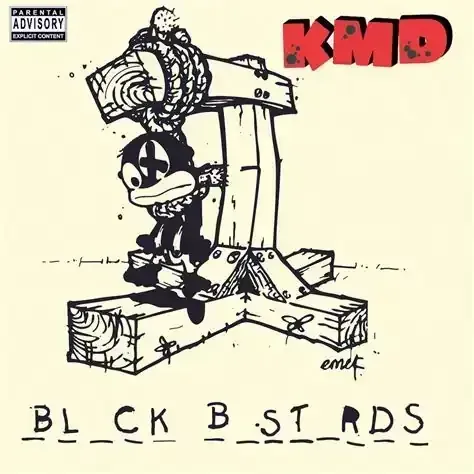

## A Villain is Born

It is 1993. Daniel Dumile (pronounced Doom-e-lay) at 22 years old, under the alias Zev Love X, part of a rap trio, KMD with his younger brother, DJ Subroc, and his friend, Onyx. They had just finished recording their second album, BL_CK B_ST_RDS. The future looked bright. However…

Onyx leaves KMD.

DJ Subroc was struck by a car and killed while crossing the Long Island Expressway.

While Dumile was grieving over the lost of his brother, their record label, Elektra Records, decided the cover art for their album was too controvesial. Mind you this was in the late 1990’s, where Hip-Hop was still in the midst of global domination it is today. Elektra Records decides to shelve the project and dropped KMD from the label. Gave Dumile something like twenty grand and the master tapes and said “Sorry for your loss”.

Imagine Dumile. Death of a family member, losing your job, and your dream project is scrapped. Your career is over.

Dumile described himself during this period as living "damn near homeless, walking the streets of Manhattan, sleeping on benches". It had broke him.

He decided to do something. Around the same time…

It's 1991. Their first album _Mr. Hood_ was released under the rap group title. During this, 19 year old Dumile, along with his groupmate Onyx, testified before the United States Congress in support of the National Voter Registration Act, on behalf of Rock the Vote.

Being the only rapper to this day to speak before the Senate about voter rights.

Rock the Vote was actively supporting the Motor Voter Bill, which eventually became the National Voter Registration Act of 1993, too signed by the then current President of the United States of America, Bill Clinton.

## Operation: Doomsday

In 1999, Daniel Dumile, now under the alias MF DOOM, wears a metal mask inspired by Marvel Comics villain Doctor Doom and lost his identity as Zev Love X. He hides his face as he wanted his music to speak more than his identity. Don’t listen to MF DOOM because he’s DOOM, listen to DOOM because he has something to say.

He declared his new debut album, Operation: Doomsday, to be a declaration of war against the entire rap industry. An industry that once betrayed him.

A Jazz-infused lo-fi, weird, brilliant and dense album, produced mostly over three weeks at DJ Stretch Armstrong’s apartment using borrowed equipment.

Raw and dusty production were you could sometimes here the mic peaking. Using obscure samples and rapping from the microphone, the villainous persona was formed. A masked villain who’d sample Fantastic Four cartoons and old Godzilla films while dropping dense rhyming schemes that made you rewind 5 times just to catch what the fuck he just said.

It become an underground classic, much like most of his work, proving to the industry that Dumile was meant to lead it. He held it by the throat.

Is that it? No. Shut the fuck up. Keep reading.

## Two Weirdos Walk Into A Bomb Shelter

It is 3 years later, 2002, Doom’s underground reputation is held strong. Operation: Doomsday, Vaudeville Villain under an alias Viktor Vaughn, and Take Me to Your Leader under the name King Geedorah. Doom would release project that wasn’t under his villainous name as a way of experimenting with multiple personas. The dude is prolific and weird and exactly what underground hip-hop needs.

Madlib walks in.

In a literal 1950s fallout shelter in Los Angeles that had been converted into a recording studio. Because of course it was.

Two of underground rap’s strangest and most respected figures are about to create the album of a century.

## The Producer Who Hated Rap

Who the fuck is Madlib, you might be asking. Cuz I did. Otis Jackson Jr., wasn’t your typical hip-hop producer. Otis had built his reputation with Quasimoto’s _The Unseen_ and his work with J Dilla as Jaylib. But he also disliked the direction the rap industry was heading towards, a commerce instead of art. He thought it was bullshit. (He might be right)

He liked Jazz. He wanted to make soul. He wanted to make literally anything except another formulaic rap beat.

He’d sample obscure Brazilian Jazz from the 60s, Ethiopian funk from the 70s and random commercial jingles just because it sounded interesting. Think early JPEGMAFIA before JPEGMAFIA. His production style was lo-fi before lo-fi was cool—dusty, crackling, weird as hell.

He wasn’t trying to top the charts, but wanted to produce art. And most rappers couldn’t handle the bizarre samples and off-time beats.
Enter Dumile, who also samples like a madman. And did not give a fuck about conventional styles. Except this guy raps over it. Seems like they were from the same threads that didn’t cross.

The chemistry was immediate. Madlib would play these abstract and sample-heavy beats that most rappers would be stunned by. And Doom would slowly start to flow a rhyme scheme that perfectly settles just over the production effortlessly. The start of Madvillian, Dumile and Otis decides to team up for one time.

While Eminem was dominating radio with The Eminem Show and 50 Cent was about to drop Get Rich or Die Tryin’ and Nelly was basically everywhere. It is mind racking to think that rap become so polished, commercial and lack any art so quickly.

## Made in a Hotel Room in Brazil

Late 2002. Madlib gets invited to the Red Bull Music Academy in Brazil and instead of just teaching classes, he decides to bring a portable setup: Boss SP-303 sampler, a turntable and a cassette deck.

No million-dollar equipment like Dr. Dre, no fancy studio. Just a dude in a São Paulo hotel room with a crate of vinyl he’d brought while crate-diggig with Cut Chemist, DJ Babu and J.Rocc.

He produced most of the album's beats including "Strange Ways," "Raid," and "Rhinestone Cowboy” right there in that hotel room. Beats that would pioneer and define underground hip-hop for the next 2 decades. (look at Tyler, the Creator’s early work)

Madlib went crate-digging in Brazil and bought multiple crates of obscure vinyl—two of which he later lost. He was sampling everything: Brazilian jazz, funk, random TV shows, shit nobody had ever heard before.

Dusty, lofi beats crackling with texture. Every beat felt like it’d been pulled from some forgotten corner of the music cave and breathe new life.

## Leaked Into Cyberspace

Unfortunately, when someone wants something, there will also be someone doing what they can to get it. And while Madlib was in Brazil producing and probably making magic, someone stole the demo tapes of the unreleased Madvillain sessions and leaked them online. 14 months prior of the the album release date.

It was 2003, the early days of leaks. Stones Throw Records thought it was the end of the project’s success and it would completely ruin sales. The tracklist that apperaed online had fake titles made up by whoever leaked it, songs like _All Caps_ was called “horny” (me every night), and _America’s Most Blunted_ was “jack off”. Whoever leaked it was either 14 years old, or had shitty humor much like mine.

Pissed off, the duo stopped working on the album entirely and only returned to it after they’d released other solo projects.

They would’ve kept it shelved, but said “Fuck it”. And finally came back together to re-record new tracks. You can listen to the leaked demo tapes online and compare it to the released version.

## Ngl, This Shit Still Fire

Doom, now a little distressed from redoing his old work, decided to take on a new approach on his delivery. Instead of him screaming into the mic much like Operation: Doomsday days, he decided to calm his lines, slower and more relaxed flow instead of enthusiastic and excited. This made it far more impactful as it didn’t feel like he was screaming it at you, but just telling you. Making you more likely to pay attention. Critics also later said this change was "ultimately better-suited" to the album.

The leaked version? More energetic, more aggressive, DOOM sounding hyped to be there.
The released version? That laid-back, almost drunk-sounding flow that makes DOOM sound like he's telling you secrets at 3 AM while chain-smoking.

I will be honest, being 19 rn, I quite prefer the more energetic version. There was a rawness to that original energy that hit different. But I would be lying if it was objectively better than his newer, calmer, more mature approach this the same lines. That relaxed delivery makes the dense wordplay even more effective. It's like he's making it look effortless when you know damn well every bar is meticulously crafted.

## MM…FOOD

When the demo tapes leaked, he decided to focus more on his new project, MM…FOOD, an album around food.

I can write another blog about this (and I might), but basically, MF DOOM wanted to challenge himself. Most rappers can barely write one good line, Doom here needs to handicap himself just to write raps. He decided to confide himself to only raps about food. Holding him back forces him to be more creative with his words, making it far more abstract.

Released on November 16, 2004, eight months after Madvillainy. Two classic albums in one year. Even Kendrick Lamar took 2 years between _good kid, m.A.A.d city_ and _To Pimp A Butterfly_ (one day I’ll write about Kendrick Lamar). This was his 2003-2004 run where he also dropped Viktor Vaughn's Vaudeville Villain and King Geedorah's Take Me to Your Leader.

4 projects, 4 personas, 1 Dumile.

## Let Me Break It Down For You

So what makes Madvillainy so special? (At least to me)

### The Production: Madlib’s Madness

Madlib's production on this album is fucking otherworldly. The beats are dusty, lo-fi, crackling with texture. He samples everything: jazz, soul, funk, TV commercials, movie soundtracks, random shit you've never heard.

Each one of his production felt like it’s been pulled from some forgotten piece of music history and given new life.

From _Accordion_ to _Meat Grinder_, who thought an accordion was suited for rap? And how the fuck does he do it so well?

The album sounds like nothing else. It's not trying to be polished or radio-friendly. It's raw, weird, beautiful chaos. It was perfect. Madlib was not interested in chasing trends, he was making trends of his own. You can hear Madlib’s inspiration in todays work much like Earl Sweatshirt, Travis Scott and JPEGMAFIA.

### The Lyricism: DOOM’s Rhymes

The greatest technical rapper of all time.

Throughout Madvillainy, DOOM uses multisyllabic rhymes, internal rhymes, allteration, assonance and holorimes. He’s not just rhyming end words like bug and rug, he’s rhyming syllables within lines, creating cascading patterns that reward repeated listens, and entire lines that rhymes itself.

PopMatters wrote:

> "You can spend hours poring over the lyric sheet and attempting to grok DOOM's infinitely dense verbiage".

If you would please, check out a role model of mine’s video on DOOM’s Figaro, where he breaks down a single verse in a 13-minute video.

[https://www.youtube.com/watch?v=CrkvZzKy2Jc](https://www.youtube.com/watch?v=CrkvZzKy2Jc)

Most rappers set up a punchline and deliver it. DOOM sets up a punchline, delivers it, then reveals a SECOND punchline you missed because you were still processing the first one. While also rhyming within itself. He rhymes here, there, then switch it up when you least expect it.

His bars are dense with comic book references, TV show samples, food metaphors (always with the food), pop culture deep cuts, and wordplay that requires an encyclopedia to fully understand.

According to Stereogum:

> "(The album) is about using sound to craft semi-indecipherable vignettes that are situated somewhere between the real and the mythical".

DOOM doesn't tell straightforward stories. He creates these abstract, free-associative verses that feel like dream logic. You're not always sure what he's talking about, but it sounds fucking insane.

Every single line is a masterclass in a technical skill. The way he bends syllables, the way he flows around full rhymes, the way he setups rhyme schemes three lines before they even pay off, they way he switches flow mid-verse, fucking absurd. He does it without sounding like he’s referring to a textbook. It doesn’t feel forced and taxing like most rappers today. It sounds casual. It's anything but.

### The Structure: Punk Rock and Jazz with a Fat Man Screaming

22 Tracks, most under 3 minutes, some are instrumentals with no hooks or choruses. This is hella important.

Most rap albums in 2004 were full of radio singles with big choruses and features. Look at Kanye West’s debut album _The College Dropout_. He perfectly blends Pop and Rap while also talking about the issues of an autistic student struggling with college life. And it was amazing. But it was commercialized and standard. You can make radio music and still be good. But it takes a lot of sacrifice to make a classic that is Madvillainy. But if you prefer _The College Dropout_, you’re not looking for a fight.

It’s structured like a punk album, short, sharp bursts of creativity that hit you and disappera before you can say “What the fuck was that?”. But it flows smooth like jazz, improvised, unpredictable and always moving.

Songs often abruptly end, with no formula and instrumental interludes breaking up the flow. It feels like flipping through a comic book, and each track a panel in a larger story.

This structure was revolutionary. It proved rap didn't need to follow commercial formats to be brilliant. You didn't need three-syllable rhymes, three-verse, hook-heavy songs to make an impact. You could create something weird and abstract and trust your audience to keep up. (even if they don’t)

Madvillainy rewards your intelligence (no matter how niche). Most albums hold you hand. Madvillainy slaps it away and says “Keep it, fucker.”

## Still in Rotation

Let me highlight the tracks that showcase this album's genius—the ones still in my rotation 20+ years later.

### Accordion

The album's first proper song, and it sets the tone immediately. That accordion loop is haunting. DOOM's flow is lazy but precise, like he's half-asleep but still sharper than everyone else awake.

This is where you know you're in for something different. The beat is unsettling. The flow is unconventional. And you're hooked like fish and bait.

### Meat Grinder

My personal favorite. Madlib pairs the album's crispiest drums with watery, muffled guitar samples. DOOM's rhyme schemes here are ridiculous—internal rhymes stacking on internal rhymes.

I still rap his first verse;

> Tripping off the beat kinda, dripping off the meat grinder
> Heat niner, pimping, stripping, soft sweet minor
> China was a neat signer, trouble with the script
> Digits double dipped, bubble lipped, subtle lisp midget

He ends his first verse unexpectedly, giving the song an unfinished feel that adds to its charm. It's disorienting in the best way possible.

### America's Most Blunted

Fun fact: This was called "jack off" on the leaked tracklist. The beat is smooth as hell, and DOOM sounds genuinely relaxed here. It's one of the more laid-back tracks, perfect for late-night listening.

The wordplay is still dense, but there's a looseness to it. DOOM's just vibing, and you're vibing with him.

Also, get it? America’s Most Wanted.. but blunted, cuz he’s high. Which he argues is not as bad for you as cocaine. Which studies shows he was right. But the Ronald Regan era made it hard to believe.

### Figaro

DOOM "lyrically dances across the track, putting together complicated rhyme schemes and flows". The beat is minimal but effective, just enough to support DOOM's verbal gymnastics without getting in the way.

The wordplay is dense enough that you catch new references on the twentieth listen. Every time I come back to this track, I hear something I missed before. Always.

### Strange Ways

That sample. Jesus Christ, that sample. Madlib flips it into something eerie and beautiful. DOOM's delivery matches the atmosphere perfectly. It’s mysterious and cryptic, exactly what you want from a supervillain.

This is the track that sounds like it was recorded in that bomb shelter and never saw daylight until the album dropped. Which is very ironic, but I won’t spoil it for ya.

### Fancy Clown

Viktor Vaughn (one of DOOM's other personas) appears here, and the track deals with betrayal and heartbreak through DOOM's signature abstract lens. It's one of the few songs on the album that feels genuinely personal, even through all the metaphor and wordplay. It’s him rapping from one his alter personas talking about Viktors girlfriend cheated on him with DOOM… while cheating on her with someone else. It’s weird I know.

The beat is jazzy and melancholic. Perfect for the theme.

### All Caps

The most accessible song on the album, and it's perfect. "Just remember ALL CAPS when you spell the man name" is one of the most iconic bars in hip-hop history.

The beat knocks. The flow is impeccable. This is the song that made casual fans into DOOM believers. If you only know one Madvillain song, it's this one.

And honestly? It deserves the recognition. This is DOOM at his most quotable, most memorable, most undeniable.

### Rhinestone Cowboy

Fun fact: DOOM actually references the leaked demo in the lyrics of this song, acknowledging the whole saga. The beat is one of Madlib's Brazilian hotel room creations, and it's hypnotic as fuck.

DOOM sounds tired here. Not in a bad way—in a "I've seen some shit" way. It's the perfect closing energy for an album this dense.

## This Album Changed Everything

Madvillainy dropped on March 23, 2004, via Stones Throw Records. Twenty-two tracks. Most under three minutes. No hooks. No choruses. No commercial appeal whatsoever.

And critics lost their fucking minds. (And so did I).

## The Public Reception

**Metacritic** gave it a 93 out of 100, and was 2004’s best reviewed rap album and the sixth highest-reviewed album today. Under To Pimp A Butterfly, Stankonia (by OutKast), DAMN. (another Kendrick Lamar), Conflict Of Interest (by idk who lmao) and Kanye West best work, _My Beautiful Dark Twisted Fantasy_.

**Pitchfork** gave it a 94, calling it “inexhaustibly brilliant, with layer-upon-layer of carefully considered yet immediate hip-hop”. They literally said "good luck finding a better hip-hop album this year, mainstream, indie, or otherwise.”

**HipHopDX** gave it a perfect 5 of 5.

The album peaked at **#179 on the Billboard 200** which is considered moderate commercial success but not exactly mainstream. But here's the thing: it attracted attention from media outlets that normally didn't cover hip-hop, including The New Yorker.

Let me repeat that. **THE FUCKING NEW YORKER** covered an underground rap album about supervillains made by a masked weirdo and a producer who made beats in a Brazilian hotel room.

Oh and **Anthony Fantano** gave it a 10 out of 10. But he also did give Brat a 10 so his opinion is still at question. (That is a joke. He is a very good reviewer. I love you Fantano mwah.)

## The Legacy

Over time, Madvillany has only grown into stature:

- NME ranked it #411 on their list of the 500 greatest albums of all time (weirdos)
- Rolling Stone put it at #365 on their 500 Greatest Albums of All Time list (more like it)
- Rolling Stone then ranked it at #18 on their 200 Greatest Hip-Hop Albums of All Time (that’s what I’m looking for)

It's now widely regarded as one of the greatest hip-hop albums ever made. Period. There was no debate.

Every underground rapper for the last 20 years has been chasing this album's legacy. Tyler, the Creator. Earl Sweatshirt. JPEGMAFIA. Joey Bada$$. They all owe a debt to Madvillainy.

The album proved you could be weird, experimental, uncompromising, and still be great. It proved that technical skill and artistic vision matter more than marketing budgets.

## What Never Was

Madvillainy was supposed to be the beginning. The duo hinted at a second project for years.

In 2010, they released _Papermill_ via Adult Swim.

In 2011, they dropped _Avalanche._

Doom kept saying “It’s almost dry” (Pusha T reference?)

Unfortunately, Daniel Dumile later passed on October 31, 2020, and the news only broke until the last day of the year. With him died any chance of finishing Madvillain 2.

Having made over 40 projects, such as six solo studio albums, multiple collaborative albums, live albums, instrumental albums, and numerous EPs and singles. MF DOOM’s legacy was set in stone.

It genuinely makes me choke up writing this. He gave me reason to even fuck with rap music. Without him, I would continue to dismiss HipHop as “just cringe talking over drums”. Thus I felt the need to write this blog.

We'll never know what they could have created together. That's the tragedy. Two geniuses at the peak of their powers, and we only got one album. But what an album it was.

## Why Madvillainy Matters

This project proved something really crucial: commercial success and artistic integrity aren’t mutually exclusive, but you don’t need the former to achieve the latter. And vice versa.

This album didn't have a major label. It didn't have radio singles. It didn't compromise its vision for mainstream appeal. And it still became one of the most influential hip-hop albums of all time.

It pioneered a generation of niche, weird, experimental, uncompromising, and passionate artists.

A rapper who’d lost everything and rebuilt himself as a villain. A producer who was tired of hip-hop but found kindred spirit to create with. With indifference, they made perfection.

## My Final Verdict

Madvillainy is the greatest rap album ever made because:

- **The production is otherworldly**: Madlib's sample choices and lo-fi aesthetic created a sound that hasn't been replicated
- **The lyricism is unmatched**: DOOM's technical skill, wordplay, and abstract storytelling set a standard that's never been surpassed
- **The structure is revolutionary**: Short songs, no hooks, punk rock pacing with jazz soul
- **The chemistry is perfect**: Two artists at the absolute peak of their powers, pushing each other to new heights
- **The influence is undeniable**: Every underground rapper for the last 20 years has been chasing this album's legacy

This album is what happens when two geniuses who don't give a fuck about commercial success lock themselves in a room and make art. No compromises. No focus groups. Just pure, raw, unfiltered creativity.

Madvillainy is widely regarded as DOOM's magnum opus. It's certainly Madlib's. But more than that, it's proof that the best art comes from artists who've suffered, who refuse to compromise, who make music for themselves first and the world second. A man who would never make shit just to make shit.

Rest In Peace the legend, MF DOOM. The greatest rapper of all time. The masked villain who testified before Congress as a teenager (at literally my age rn btw), lost his brother and career, lived homeless, then rose from the bottom to make his greatest works over his career.

Just remember ALL CAPS when you spell the man name.

_If you will excuse me, I will go cry now._
